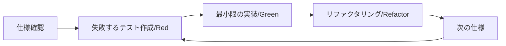

# テスト項目書

## 1. テスト概要

### 1.1 テスト方針
- **TDD（テスト駆動開発）**に基づく実装
- Red → Green → Refactorのサイクルを厳守
- テストファーストで仕様を明確化

### 1.2 テストレベル
1. **単体テスト（Unit Test）**: 各モジュールの機能検証
2. **統合テスト（Integration Test）**: モジュール間連携検証
3. **E2Eテスト（End-to-End Test）**: ユーザーシナリオ検証
4. **性能テスト（Performance Test）**: パフォーマンス要件検証

## 2. 単体テスト項目

### 2.1 フィルターエンジン（Core）

#### UT-FE-001: URLパターンマッチング
```rust
#[test]
fn test_url_pattern_matching() {
    // Given: 広告ドメインのパターンルール
    let rule = FilterRule::new("||doubleclick.net^");
    let engine = FilterEngine::with_rules(vec![rule]);
    
    // When: URLをチェック
    let result1 = engine.should_block("https://doubleclick.net/ad");
    let result2 = engine.should_block("https://example.com");
    
    // Then: 広告URLのみブロック
    assert!(result1.is_blocked());
    assert!(!result2.is_blocked());
}
```

#### UT-FE-002: ワイルドカードマッチング
```rust
#[test]
fn test_wildcard_pattern() {
    // Given: ワイルドカードを含むルール
    let rule = FilterRule::new("*/ads/*");
    let engine = FilterEngine::with_rules(vec![rule]);
    
    // When & Then
    assert!(engine.should_block("https://example.com/ads/banner.jpg").is_blocked());
    assert!(!engine.should_block("https://example.com/content/image.jpg").is_blocked());
}
```

#### UT-FE-003: ドメイン別ルール適用
```rust
#[test]
fn test_domain_specific_rules() {
    // Given: 特定ドメイン用のルール
    let rule = FilterRule::css_hide(".ad-container", vec!["youtube.com"]);
    let engine = FilterEngine::with_rules(vec![rule]);
    
    // When & Then
    let youtube_rules = engine.get_injection_rules("youtube.com");
    let other_rules = engine.get_injection_rules("example.com");
    
    assert_eq!(youtube_rules.css_rules.len(), 1);
    assert_eq!(other_rules.css_rules.len(), 0);
}
```

#### UT-FE-004: ルール優先度
```rust
#[test]
fn test_rule_priority() {
    // Given: 優先度の異なる競合ルール
    let block_rule = FilterRule::new("||example.com^").with_priority(100);
    let allow_rule = FilterRule::new("@@||example.com/allowed^").with_priority(1000);
    let engine = FilterEngine::with_rules(vec![block_rule, allow_rule]);
    
    // When & Then
    assert!(!engine.should_block("https://example.com/allowed").is_blocked());
    assert!(engine.should_block("https://example.com/blocked").is_blocked());
}
```

#### UT-FE-005: パフォーマンステスト
```rust
#[test]
fn test_performance_requirements() {
    // Given: 10万件のルール
    let rules = generate_test_rules(100_000);
    let engine = FilterEngine::with_rules(rules);
    
    // When: 1000回の判定
    let start = Instant::now();
    for _ in 0..1000 {
        engine.should_block("https://test.example.com/ad/banner");
    }
    let elapsed = start.elapsed();
    
    // Then: 平均10ms以内
    assert!(elapsed.as_millis() / 1000 < 10);
}
```

### 2.2 ネットワークインターセプター

#### UT-NI-001: パケット解析
```rust
#[test]
fn test_packet_parsing() {
    // Given: HTTPリクエストパケット
    let packet_data = create_http_request_packet("GET", "http://example.com");
    
    // When: パケット解析
    let parsed = PacketParser::parse(&packet_data);
    
    // Then: 正しく解析される
    assert_eq!(parsed.method, "GET");
    assert_eq!(parsed.host, "example.com");
}
```

#### UT-NI-002: HTTPS判定
```rust
#[test]
fn test_https_detection() {
    // Given: HTTPSハンドシェイクパケット
    let tls_packet = create_tls_client_hello("secure.example.com");
    
    // When & Then
    let parsed = PacketParser::parse(&tls_packet);
    assert!(parsed.is_https());
    assert_eq!(parsed.sni_hostname, Some("secure.example.com"));
}
```

### 2.3 統計モジュール

#### UT-ST-001: ブロック数カウント
```rust
#[test]
fn test_statistics_counting() {
    // Given: 統計モジュール
    let mut stats = Statistics::new();
    
    // When: イベント記録
    stats.record_blocked("doubleclick.net", 1024);
    stats.record_blocked("googleads.com", 2048);
    stats.record_allowed("example.com", 512);
    
    // Then: 正しくカウント
    assert_eq!(stats.total_blocked(), 2);
    assert_eq!(stats.total_allowed(), 1);
    assert_eq!(stats.data_saved(), 3072);
}
```

#### UT-ST-002: ドメイン別統計
```rust
#[test]
fn test_domain_statistics() {
    // Given: 複数のブロックイベント
    let mut stats = Statistics::new();
    stats.record_blocked("ads.com", 100);
    stats.record_blocked("ads.com", 200);
    stats.record_blocked("tracker.com", 150);
    
    // When: TOP統計取得
    let top_domains = stats.top_blocked_domains(10);
    
    // Then: 正しい順序とカウント
    assert_eq!(top_domains[0].domain, "ads.com");
    assert_eq!(top_domains[0].count, 2);
    assert_eq!(top_domains[0].data_saved, 300);
}
```

## 3. 統合テスト項目

### 3.1 Android VPNサービス統合

#### IT-AND-001: VPN確立と通信フロー
```kotlin
@Test
fun test_vpn_establishment_and_traffic_flow() {
    // Given: VPNサービス起動準備
    val scenario = ServiceTestRule()
    val intent = Intent(context, AdBlockVpnService::class.java)
    
    // When: サービス開始
    scenario.startService(intent)
    
    // Then: VPN確立を確認
    await().atMost(5, SECONDS).until {
        AdBlockVpnService.isConnected()
    }
    
    // When: HTTPリクエスト送信
    val response = httpClient.get("http://doubleclick.net/ad")
    
    // Then: ブロックされる
    assertTrue(response.isBlocked)
}
```

#### IT-AND-002: YouTube広告ブロック統合
```kotlin
@Test
fun test_youtube_ad_blocking_integration() {
    // Given: YouTube WebView
    val webView = WebView(context)
    val blocker = YouTubeAdBlocker()
    
    // When: スクリプト注入
    blocker.injectIntoWebView(webView)
    webView.loadUrl("https://www.youtube.com/watch?v=test")
    
    // Then: 広告要素が非表示
    await().until {
        webView.evaluateJavascript(
            "document.querySelector('.ytp-ad-module') === null",
            ValueCallback { result -> 
                assertEquals("true", result)
            }
        )
    }
}
```

### 3.2 iOS Network Extension統合

#### IT-iOS-001: Network Extension動作確認
```swift
func test_network_extension_filtering() async throws {
    // Given: Network Extension設定
    let manager = NEFilterManager.shared()
    let config = NEFilterProviderConfiguration()
    
    // When: 有効化
    manager.providerConfiguration = config
    try await manager.saveToPreferences()
    try await manager.loadFromPreferences()
    
    // Then: フィルタリング確認
    let testURL = URL(string: "https://googleads.com/ad")!
    let blocked = await testBlockingDecision(for: testURL)
    XCTAssertTrue(blocked)
}
```

## 4. E2Eテスト項目

### 4.1 基本シナリオ

#### E2E-001: 初回セットアップ
```gherkin
Feature: 初回セットアップ
  Scenario: ユーザーが初めてアプリを起動する
    Given アプリを初回起動する
    When 権限許可画面が表示される
    And VPN権限を許可する
    Then メイン画面が表示される
    And 広告ブロックが有効になっている
```

#### E2E-002: 広告ブロックのON/OFF切り替え
```gherkin
Feature: 広告ブロック切り替え
  Scenario: ユーザーが広告ブロックを無効化して再度有効化する
    Given 広告ブロックが有効な状態
    When メイン画面のトグルをOFFにする
    Then VPNが切断される
    And ステータスが「無効」と表示される
    When トグルを再度ONにする
    Then VPNが再接続される
    And ステータスが「有効」と表示される
```

#### E2E-003: YouTube広告ブロック
```gherkin
Feature: YouTube広告ブロック
  Scenario: YouTubeで動画を視聴する
    Given 広告ブロックが有効な状態
    When YouTubeアプリで動画を開く
    Then プレロール広告が表示されない
    And 動画が即座に再生される
    And オーバーレイ広告が表示されない
```

## 5. 性能テスト項目

### 5.1 負荷テスト

#### PT-001: 高負荷時のレスポンス
```yaml
test_name: 高負荷時レスポンステスト
conditions:
  - リクエスト数: 1000req/s
  - 継続時間: 5分
  - 同時接続数: 100
expected:
  - 平均応答時間: < 10ms
  - エラー率: < 0.1%
  - CPU使用率: < 50%
```

#### PT-002: メモリリークテスト
```yaml
test_name: 長時間稼働テスト
conditions:
  - 実行時間: 24時間
  - 通常使用パターン
expected:
  - メモリ使用量増加: < 10MB
  - クラッシュ: 0回
```

### 5.2 バッテリーテスト

#### PT-003: バッテリー消費測定
```yaml
test_name: バッテリー影響測定
conditions:
  - デバイス: 標準的なAndroid/iOSデバイス
  - 測定時間: 24時間
  - 使用パターン: 通常のWeb/アプリ使用
expected:
  - 追加バッテリー消費: < 3%
```

## 6. セキュリティテスト

### 6.1 通信セキュリティ

#### ST-001: HTTPS検証
```rust
#[test]
fn test_certificate_validation() {
    // Given: 不正な証明書のサーバー
    let client = create_test_client_with_invalid_cert();
    
    // When: ルール更新を試行
    let result = client.update_rules();
    
    // Then: エラーとなる
    assert!(matches!(result, Err(Error::CertificateValidation(_))));
}
```

### 6.2 プライバシー保護

#### ST-002: ログ記録確認
```rust
#[test]
fn test_no_sensitive_logging() {
    // Given: 個人情報を含むリクエスト
    let request = Request::new("https://example.com/user?id=12345&token=secret");
    
    // When: ブロック判定とログ記録
    let engine = FilterEngine::new();
    engine.should_block(&request);
    
    // Then: ログに個人情報が含まれない
    let logs = engine.get_logs();
    assert!(!logs.contains("12345"));
    assert!(!logs.contains("secret"));
}
```

## 7. TDDサイクル定義

### 7.1 実装フロー



### 7.2 テスト作成ガイドライン

1. **Red Phase**
   - 仕様から最小のテストケースを抽出
   - 期待値を明確に定義
   - テストが失敗することを確認

2. **Green Phase**
   - テストを通す最小限のコード実装
   - ハードコーディングも許容
   - とにかくテストを通すことに集中

3. **Refactor Phase**
   - 重複を除去
   - 適切な抽象化
   - パフォーマンス最適化
   - テストが通り続けることを確認

### 7.3 コミットルール
- Red: `test: Add failing test for [feature]`
- Green: `feat: Implement [feature] to pass test`
- Refactor: `refactor: Improve [feature] implementation`

## 8. テスト環境

### 8.1 必要なツール
- Rust: `cargo test`, `cargo tarpaulin`（カバレッジ）
- Android: JUnit, Espresso, Mockito
- iOS: XCTest, Quick/Nimble

### 8.2 CI/CD統合
```yaml
# .github/workflows/test.yml
name: Test
on: [push, pull_request]
jobs:
  test:
    runs-on: ubuntu-latest
    steps:
      - uses: actions/checkout@v3
      - name: Run tests
        run: |
          cargo test --all
          cd android && ./gradlew test
      - name: Coverage report
        run: cargo tarpaulin --out Xml
      - name: Upload coverage
        uses: codecov/codecov-action@v3
```

### 8.3 カバレッジ目標
- 単体テスト: 90%以上
- 統合テスト: 80%以上
- E2Eテスト: 主要シナリオ100%