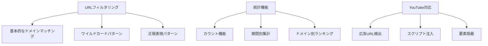

# TDD（テスト駆動開発）ガイド

## 1. TDDの基本原則

### 1.1 TDDの3つのルール（by Robert C. Martin）
1. **失敗するテストを書くまで、プロダクションコードを書いてはならない**
2. **失敗させるのに十分なテストだけを書く**（コンパイルエラーも失敗）
3. **現在失敗しているテストを通すのに十分なプロダクションコードだけを書く**

### 1.2 Red-Green-Refactorサイクル
```
┌─────────┐     ┌─────────┐     ┌──────────────┐
│   Red   │────▶│  Green  │────▶│   Refactor   │
│失敗する │     │テストが │     │ コードを    │
│テスト   │     │ 通る    │     │ 改善する    │
└─────────┘     └─────────┘     └──────────────┘
     ▲                                    │
     └────────────────────────────────────┘
```

## 2. 実装例：URLフィルタリング機能

### 2.1 仕様
「広告配信ドメイン（doubleclick.net）からのリクエストをブロックする」

### 2.2 Step 1: Red - 失敗するテストを書く

```rust
// tests/filter_engine_test.rs
#[cfg(test)]
mod tests {
    use super::*;

    #[test]
    fn should_block_doubleclick_domain() {
        // Arrange
        let engine = FilterEngine::new();
        
        // Act
        let result = engine.should_block("https://doubleclick.net/ad");
        
        // Assert
        assert!(result);
    }
}
```

**実行結果**:
```bash
$ cargo test
error[E0433]: failed to resolve: use of undeclared type `FilterEngine`
```

### 2.3 Step 2: Green - テストを通す最小限の実装

```rust
// src/filter_engine.rs
pub struct FilterEngine;

impl FilterEngine {
    pub fn new() -> Self {
        FilterEngine
    }
    
    pub fn should_block(&self, url: &str) -> bool {
        // 最小限の実装：ハードコーディングでもOK
        url.contains("doubleclick.net")
    }
}
```

**実行結果**:
```bash
$ cargo test
test tests::should_block_doubleclick_domain ... ok
```

### 2.4 Step 3: 次のテストケースを追加

```rust
#[test]
fn should_not_block_normal_domain() {
    // Arrange
    let engine = FilterEngine::new();
    
    // Act
    let result = engine.should_block("https://example.com");
    
    // Assert
    assert!(!result);
}

#[test]
fn should_block_multiple_ad_domains() {
    // Arrange
    let engine = FilterEngine::new();
    
    // Act & Assert
    assert!(engine.should_block("https://googleadservices.com"));
    assert!(engine.should_block("https://googlesyndication.com"));
}
```

### 2.5 Step 4: Refactor - より良い実装へ

```rust
// src/filter_engine.rs
pub struct FilterEngine {
    blocked_domains: Vec<String>,
}

impl FilterEngine {
    pub fn new() -> Self {
        FilterEngine {
            blocked_domains: vec![
                "doubleclick.net".to_string(),
                "googleadservices.com".to_string(),
                "googlesyndication.com".to_string(),
            ],
        }
    }
    
    pub fn should_block(&self, url: &str) -> bool {
        self.blocked_domains.iter().any(|domain| url.contains(domain))
    }
}
```

## 3. TDDベストプラクティス

### 3.1 テストの命名規則
```rust
// ❌ 悪い例
#[test]
fn test1() { }

// ✅ 良い例
#[test]
fn should_block_request_when_url_matches_ad_pattern() { }

// ✅ Given-When-Then形式
#[test]
fn given_ad_domain_when_checking_url_then_returns_blocked() { }
```

### 3.2 AAA（Arrange-Act-Assert）パターン
```rust
#[test]
fn should_calculate_statistics_correctly() {
    // Arrange - 準備
    let mut stats = Statistics::new();
    
    // Act - 実行
    stats.record_blocked("ads.com", 1024);
    stats.record_blocked("tracker.com", 2048);
    
    // Assert - 検証
    assert_eq!(stats.total_blocked(), 2);
    assert_eq!(stats.data_saved(), 3072);
}
```

### 3.3 テストダブルの活用
```rust
// モックオブジェクトの例
#[cfg(test)]
mod tests {
    use mockall::*;
    
    #[automock]
    trait NetworkClient {
        fn fetch(&self, url: &str) -> Result<String, Error>;
    }
    
    #[test]
    fn should_handle_network_error() {
        // Arrange
        let mut mock = MockNetworkClient::new();
        mock.expect_fetch()
            .returning(|_| Err(Error::NetworkTimeout));
            
        let updater = RuleUpdater::new(Box::new(mock));
        
        // Act
        let result = updater.update();
        
        // Assert
        assert!(result.is_err());
    }
}
```

## 4. 実装の進め方

### 4.1 機能分解とテスト順序



### 4.2 1つのテストサイクルの時間目安
- Red: 5-10分（テスト作成）
- Green: 10-15分（実装）
- Refactor: 5-10分（改善）
- **合計: 20-35分/サイクル**

### 4.3 コミット戦略

```bash
# Red phase
git add tests/
git commit -m "test: Add failing test for domain blocking"

# Green phase
git add src/
git commit -m "feat: Implement basic domain blocking"

# Refactor phase
git add src/
git commit -m "refactor: Extract domain list to configuration"
```

## 5. Android/iOS固有のTDD

### 5.1 Android（Kotlin）の例

```kotlin
class AdBlockViewModelTest {
    @get:Rule
    val instantTaskExecutorRule = InstantTaskExecutorRule()
    
    private lateinit var viewModel: AdBlockViewModel
    private val mockService = mockk<AdBlockService>()
    
    @Before
    fun setup() {
        viewModel = AdBlockViewModel(mockService)
    }
    
    @Test
    fun `when toggle blocking then service should start`() {
        // Given
        every { mockService.start() } returns Result.success(Unit)
        
        // When
        viewModel.toggleBlocking()
        
        // Then
        verify { mockService.start() }
        assertEquals(true, viewModel.isBlockingEnabled.value)
    }
}
```

### 5.2 iOS（Swift）の例

```swift
import XCTest
@testable import AdBlocker

class FilterEngineTests: XCTestCase {
    var sut: FilterEngine!
    
    override func setUp() {
        super.setUp()
        sut = FilterEngine()
    }
    
    func test_shouldBlock_whenDoubleClickDomain_returnsTrue() {
        // Given
        let url = "https://doubleclick.net/ad"
        
        // When
        let result = sut.shouldBlock(url: url)
        
        // Then
        XCTAssertTrue(result)
    }
}
```

## 6. TDDアンチパターン

### 6.1 避けるべきこと

#### ❌ テストを後から書く
```rust
// プロダクションコードを先に書いてしまう
impl FilterEngine {
    pub fn complex_logic(&self) -> Result<(), Error> {
        // 100行のロジック...
    }
}

// 後からテストを書く（TDDではない）
#[test]
fn test_complex_logic() { /* ... */ }
```

#### ❌ 一度に多くのテストを書く
```rust
// 10個のテストを一度に書く（Red phase が長すぎる）
#[test]
fn test_1() { /* ... */ }
#[test]
fn test_2() { /* ... */ }
// ... test_10まで
```

#### ❌ テストのためのテスト
```rust
// 実装の詳細をテストしてしまう
#[test]
fn should_use_hashmap_internally() {
    // 内部実装に依存したテスト
}
```

### 6.2 良いTDDの指標
- テストが仕様を表現している
- テストが読みやすい
- 実装を変更してもテストは変更不要
- 各サイクルが30分以内

## 7. TDD実践チェックリスト

### 7.1 Red Phase
- [ ] テストが失敗することを確認した
- [ ] テスト名が仕様を表している
- [ ] 最小限のテストケースである

### 7.2 Green Phase
- [ ] テストが通ることを確認した
- [ ] 最小限の実装である
- [ ] 他のテストが壊れていない

### 7.3 Refactor Phase
- [ ] 全てのテストが通っている
- [ ] 重複が除去されている
- [ ] 命名が適切である
- [ ] コードが読みやすい

## 8. 継続的なTDD実践

### 8.1 日次の振り返り
- 今日書いたテストの数
- Red-Green-Refactorサイクルの回数
- 詰まった箇所と解決方法

### 8.2 週次の改善
- テストの品質向上
- サイクル時間の短縮
- チーム内での知識共有

### 8.3 測定指標
- コードカバレッジ（目標: 90%+）
- サイクル時間（目標: 30分以内）
- バグ発見率（本番環境 vs テスト環境）